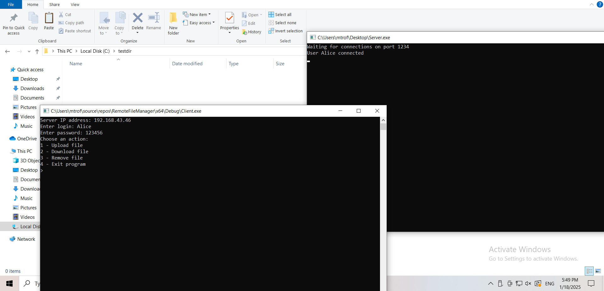
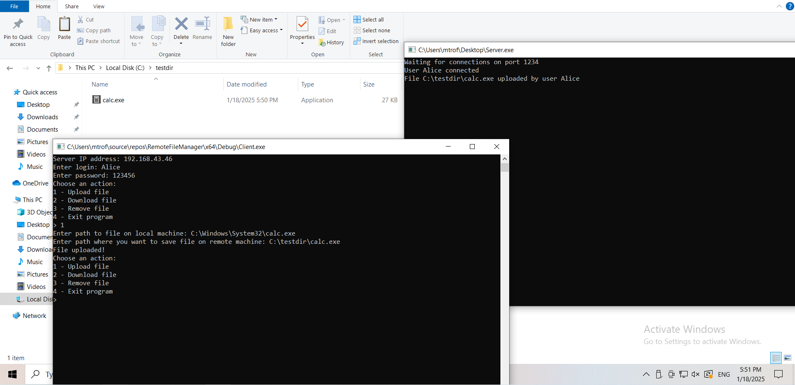
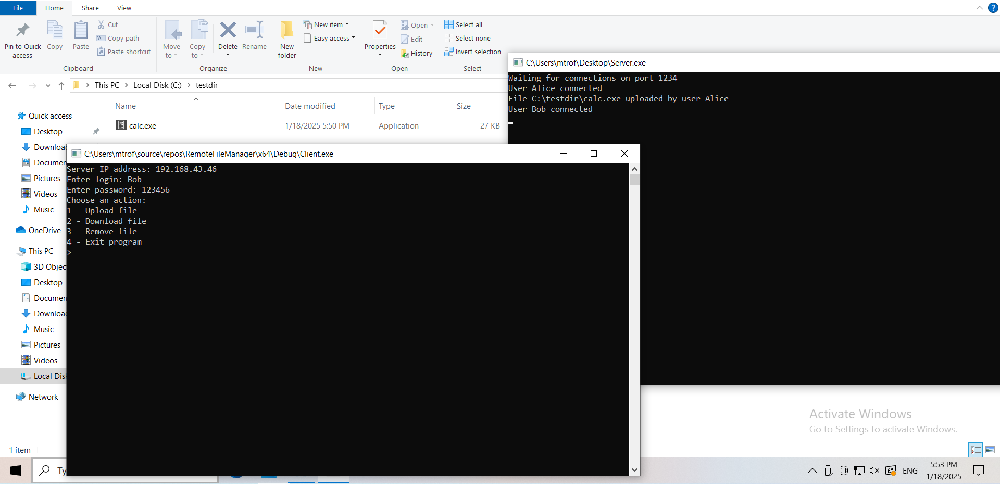
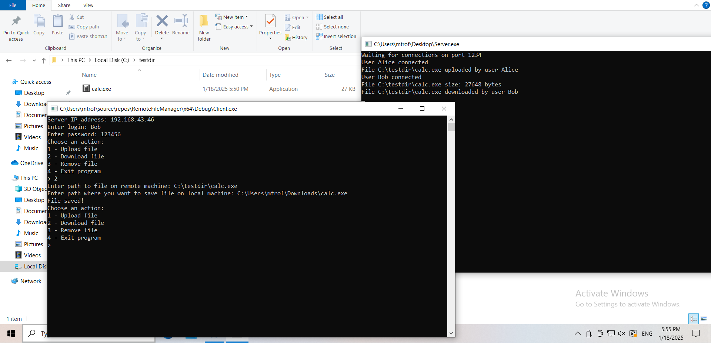

# RemoteFileManager
## Удаленный файловый менеджер с имперсонацией клиента
### Компиляция:
1. Для сборки Client.exe включить в проект следующие файлы:
   - client.cpp
   - interface.h
   - interface.idl
   - interface_c.c
2. Для сборки Server.exe включить в проект следующие файлы:
   - interface.h
   - interface.idl
   - interface_s.c
   - server.cpp

### Пример загрузки файла на сервер:

### Пример скачивания файла с сервера:

